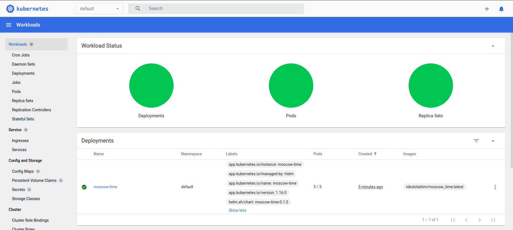

## Creating a deployment and a service from command line

### 1. Deployment

```shell
$ kubectl create deployment python_app --image=nikololiahim/moscow_time

NAME         READY   UP-TO-DATE   AVAILABLE   AGE
python-app   1/1     1            1           97s
```

### 2. Service
```shell
$ kubectl expose deployment python-app --type=LoadBalancer --port=8080
$ kubectl get services

NAME         TYPE           CLUSTER-IP      EXTERNAL-IP   PORT(S)          AGE
kubernetes   ClusterIP      10.96.0.1       <none>        443/TCP          17m
python-app   LoadBalancer   10.110.24.198   <pending>     8000:31924/TCP   7s

$ minikube service python-app
|-----------|------------|-------------|---------------------------|
| NAMESPACE |    NAME    | TARGET PORT |            URL            |
|-----------|------------|-------------|---------------------------|
| default   | python-app |        8000 | http://192.168.49.2:31924 |
|-----------|------------|-------------|---------------------------|
```
### 3. `kubectl get pods,svc` output


```shell
$ kubectl get pods,svc

NAME                              READY   STATUS    RESTARTS   AGE
pod/python-app-6f659494fc-pt8d9   1/1     Running   0          16m

NAME                 TYPE           CLUSTER-IP      EXTERNAL-IP   PORT(S)          AGE
service/kubernetes   ClusterIP      10.96.0.1       <none>        443/TCP          19m
service/python-app   LoadBalancer   10.110.24.198   <pending>     8000:31924/TCP   2m8s
```

### 4. Cleanup

```shell
$ kubectl delete service python-app
service "python-app" deleted

$ kubectl delete deployment python-app
deployment.apps "python-app" deleted
```

## Creating a deployment from .yaml configuration files
### ```kubectl get pods,svc``` output


```shell
$ kubectl get pods,svc

NAME                                         READY   STATUS    RESTARTS   AGE
pod/python-app-deployment-67b95d59bb-cbs5b   1/1     Running   0          67m
pod/python-app-deployment-67b95d59bb-szhnw   1/1     Running   0          67m
pod/python-app-deployment-67b95d59bb-vthmt   1/1     Running   0          67m

NAME                         TYPE           CLUSTER-IP       EXTERNAL-IP   PORT(S)          AGE
service/kubernetes           ClusterIP      10.96.0.1        <none>        443/TCP          147m
service/python-app-service   LoadBalancer   10.109.185.239   <pending>     8000:30000/TCP   25m

```

## Creating a deployment and a service using a Helm Chart

```shell
$ helm install moscow-time moscow-time
```

### `kubectl get pods,svc` output
```shell
NAME                               READY   STATUS    RESTARTS   AGE
pod/moscow-time-6cc7f8dc64-gnlp8   1/1     Running   0          4m11s
pod/moscow-time-6cc7f8dc64-j4nnx   1/1     Running   0          4m11s
pod/moscow-time-6cc7f8dc64-qrkg2   1/1     Running   0          4m11s

NAME                  TYPE           CLUSTER-IP      EXTERNAL-IP   PORT(S)          AGE
service/kubernetes    ClusterIP      10.96.0.1       <none>        443/TCP          23h
service/moscow-time   LoadBalancer   10.97.196.216   <pending>     8000:32604/TCP   4m11s
```

### Minikube Dashboard

